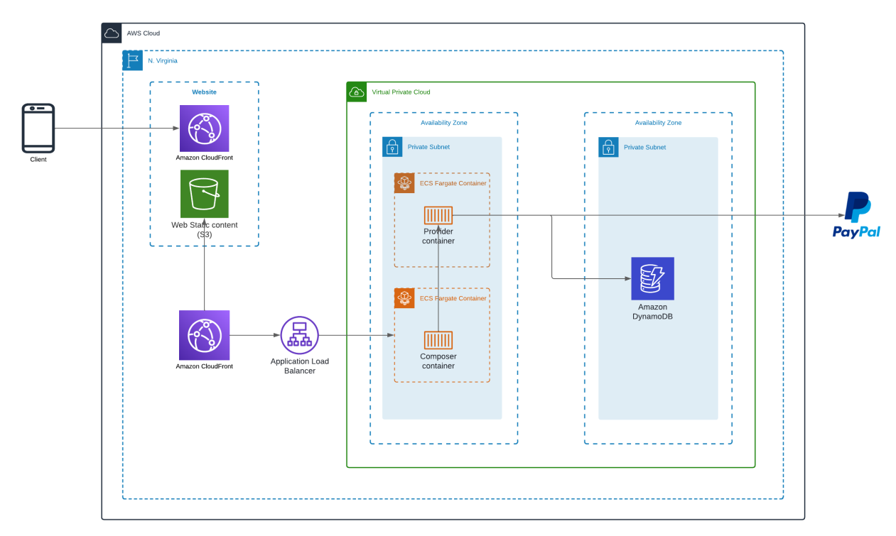

# interactive.believe.co

# 📌 AWS CloudFormation Architecture Deployment

## 🚀 Overview
This repository contains an AWS CloudFormation template to deploy a microservices-based architecture that includes:

- **Amazon S3 + CloudFront** for hosting static web content.
- **ECS Fargate Containers** for API services.
- **Application Load Balancer (ALB)** for routing traffic.
- **API Gateway** for REST and GraphQL APIs.
- **DynamoDB** for data storage.
- **PayPal Integration** for transactions.

## 🏗 Architecture Diagram


## 🔄 Sequence Diagram


## 📜 Features
- **REST API** for catalog generation.
- **GraphQL API** to expose data.
- **PayPal integration** for payment processing.
- **CloudFormation-based Infrastructure as Code (IaC).**
- **Highly available and scalable architecture.**

## 📂 Project Structure
```
├── cloudformation/              # CloudFormation templates
│   ├── main.yaml                # Main stack 
│   ├── other..yaml
├── src/                         # Application source code
│   ├── composer_container/       # Composer API (GraphQL)
│   ├── provider_container/       # Provider API (REST)
├── README.md                    # Documentation
```

## 🛠 Deployment Steps
### 1️⃣ Clone the repository
```sh
git clone git@github.com:KaishveTatva/interactive.believe.co.git
cd your-repo
```

### 2️⃣ Deploy CloudFormation Stack
```sh
aws cloudformation create-stack --stack-name MyAppStack \
  --template-body file://infrastructure/main.yaml \
  --capabilities CAPABILITY_NAMED_IAM
```

### 3️⃣ Verify Stack Deployment
Go to AWS Console > CloudFormation > Check Stack Status.

### 4️⃣ Update Stack (if needed)
```sh
aws cloudformation update-stack --stack-name MyAppStack \
  --template-body file://cloudformation/main.yaml \
  --capabilities CAPABILITY_NAMED_IAM
```

### 5️⃣ Delete Stack (Cleanup)
```sh
aws cloudformation delete-stack --stack-name MyAppStack
```

## 🚀 Future Enhancements
- Implement CI/CD using AWS CodePipeline.
- Enhance security with IAM policies & WAF.
- Auto-scaling policies for ECS containers.


